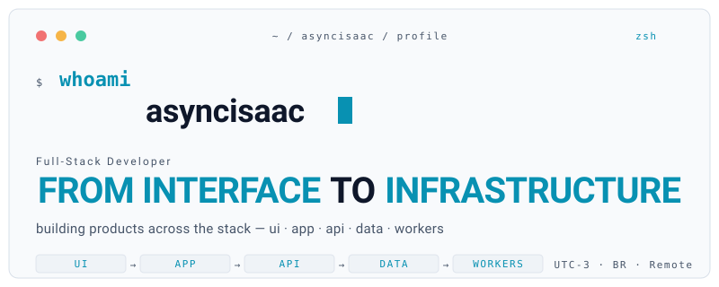
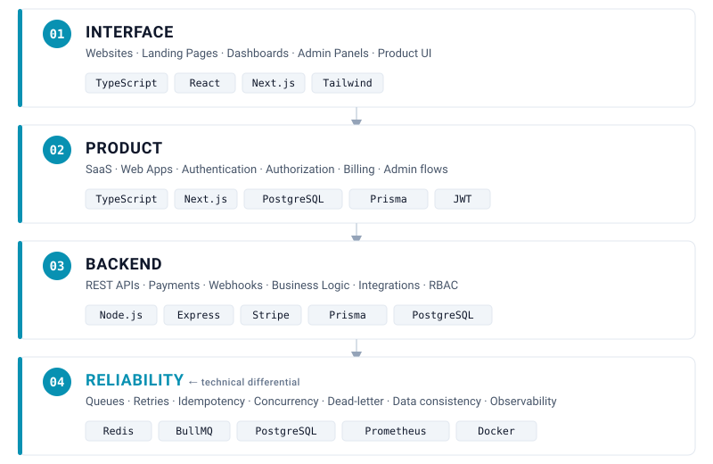
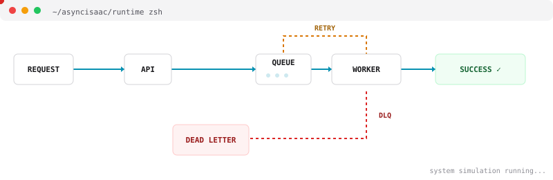

  <a href="#top">
    <picture>
      <source media="(prefers-color-scheme: dark)"  srcset="assets/hero-dark.svg">
      <source media="(prefers-color-scheme: light)" srcset="assets/hero-light.svg">
      
    </picture>
  </a>

 

  <code><strong>Isaac Marinho</strong> · Full-Stack Developer · Brazil · UTC-3 · Remote Worldwide</code>
   
  <code>Open to freelance &amp; contract work</code>

  
  &nbsp;
  
  &nbsp;
  

---

<picture>
  <source media="(prefers-color-scheme: dark)"  srcset="assets/section-divider-dark.svg">
  <source media="(prefers-color-scheme: light)" srcset="assets/section-divider-light.svg">
  
</picture>

### `//` about

I work with TypeScript across the full stack, from the first screen of a product down to
background workers, payment ledgers and database transactions.

I'm equally comfortable building a landing page, a dashboard or an admin panel — and I
pay special attention to the parts of a system where correctness matters: retries,
duplicate events, concurrent updates, partial failures, webhook delivery and data consistency.

 

<picture>
  <source media="(prefers-color-scheme: dark)"  srcset="assets/section-divider-dark.svg">
  <source media="(prefers-color-scheme: light)" srcset="assets/section-divider-light.svg">
  
</picture>

### `//` from interface to infrastructure

Four layers I work on when building a complete product — not just one side of the stack.

 

  <picture>
    <source media="(prefers-color-scheme: dark)"  srcset="assets/stack-flow-dark.svg">
    <source media="(prefers-color-scheme: light)" srcset="assets/stack-flow-light.svg">
    
  </picture>

 

<picture>
  <source media="(prefers-color-scheme: dark)"  srcset="assets/section-divider-dark.svg">
  <source media="(prefers-color-scheme: light)" srcset="assets/section-divider-light.svg">
  
</picture>

### `//` core stack

Curated. Tools I actually use and build with.

 

**`FRONTEND`**

&nbsp;
&nbsp;
&nbsp;

 

**`BACKEND`**

&nbsp;
&nbsp;
&nbsp;

 

**`DATA & SYSTEMS`**

&nbsp;
&nbsp;
&nbsp;
&nbsp;
&nbsp;

 

<picture>
  <source media="(prefers-color-scheme: dark)"  srcset="assets/section-divider-dark.svg">
  <source media="(prefers-color-scheme: light)" srcset="assets/section-divider-light.svg">
  
</picture>

### `//` beyond the happy path

The problems I find most interesting — the ones that make software stop being a demo.

 

`duplicate payments`
`concurrent inventory updates`
`webhook replays`
`failed jobs`
`retries & backoff`
`partial failures`
`data consistency`
`race conditions`
`idempotency`
`transaction safety`

 

<picture>
  <source media="(prefers-color-scheme: dark)"  srcset="assets/section-divider-dark.svg">
  <source media="(prefers-color-scheme: light)" srcset="assets/section-divider-light.svg">
  
</picture>

### `//` selected work

Projects that cover different layers of the stack.

---

<picture>
  <source media="(prefers-color-scheme: dark)"  srcset="assets/flagship-banner-dark.svg">
  <source media="(prefers-color-scheme: light)" srcset="assets/flagship-banner-light.svg">
  
</picture>

## Async Job Processing Platform

> A multi-tenant background-job system designed to safely process work under retries and partial failures.

**Stack:**
`TypeScript` `Node.js` `Redis` `BullMQ` `PostgreSQL` `Prisma`

**Engineering highlights:**
`IDEMPOTENCY`
`RETRY / BACKOFF`
`DLQ + REPLAY`
`MULTI-TENANCY`
`RATE / QUOTA / CONCURRENCY`
`OBSERVABILITY`
`SCOPED API KEYS`

- Idempotency enforced on two layers — unique DB constraint per (tenantId, idempotencyKey) and scoped per-job effect records.
- Dead-letter queue with automatic job replay flow and manual retry endpoints.
- Retries + exponential backoff + jitter, separated from long-running API handlers.
- Per-tenant rate limits, job quotas and max concurrency caps.
- Prometheus metrics, structured logs with correlation IDs and a full per-job event audit log.
- API and workers split into separate processes for independent horizontal scaling.

**[Repository →](https://github.com/asyncisaac/async-job-processing-platform)**

---

### Payment System — Ledger-First

Immutable balance ledger with idempotent payment processing and refunds.

**Stack:**
`Node.js` `Stripe` `PostgreSQL` `BullMQ` `React`

- Balances derived from an append-only ledger (SUM of entries), never direct UPDATEs.
- Idempotency enforced at API level (unique key) and worker level (unique per-payment event row).
- Retry + dead-letter pipeline for async payment confirmations and failures.
- Refunds use the same status-transition pipeline with full audit trail.
- Concurrent race-condition integration tests with two parallel workers.

**[Repository →](https://github.com/asyncisaac/payment-system)**

---

### E-commerce Platform · Full-Stack Monorepo

Complete storefront, auth, checkout pipeline and admin panel.

**Stack:**
`Next.js` `React` `Express` `Prisma` `PostgreSQL` `Stripe Checkout`

- Atomic stock decrement (`UPDATE ... WHERE stock >= qty`) with explicit 409 on lost race.
- Stripe webhook idempotency enforced by `event.id UNIQUE` in DB.
- Stock reservation restored automatically for expired or failed async payments.
- JWT + rotating refresh tokens with role-based admin access.
- Observability hooks: pino logger, structured error payloads, health endpoints and automated tests.

**[Repository →](https://github.com/asyncisaac/ecommerce-monorepo)**

---

##### Gamified Bug Tracker · secondary / product

Bug tracker with XP / levels per severity. Single-transaction close + XP grants. Next.js 15 App Router + optimistic UI.

**Stack:** `Next.js 15` `Prisma` `PostgreSQL`

**[Repository →](https://github.com/asyncisaac/Gamified-Bug-Tracker)**

 

<picture>
  <source media="(prefers-color-scheme: dark)"  srcset="assets/section-divider-dark.svg">
  <source media="(prefers-color-scheme: light)" srcset="assets/section-divider-light.svg">
  
</picture>

### `//` what i can build

Types of engagements that fit my stack and interests.

- Full-Stack TypeScript applications
- SaaS MVPs and web apps
- Next.js websites, landing pages & dashboards
- Backend APIs and domain logic
- Stripe integration & webhook pipelines
- PostgreSQL data modeling & Prisma schemas
- Redis / BullMQ background workers
- Authentication & authorization flows
- Refactoring & debugging existing codebases
- Third-party API integrations

 

  <picture>
    <source media="(prefers-color-scheme: dark)"  srcset="assets/async-simulator-dark.svg">
    <source media="(prefers-color-scheme: light)" srcset="assets/async-simulator-light.svg">
    
  </picture>

 

<picture>
  <source media="(prefers-color-scheme: dark)"  srcset="assets/section-divider-dark.svg">
  <source media="(prefers-color-scheme: light)" srcset="assets/section-divider-light.svg">
  
</picture>

### `//` let's build something

Open to freelance and remote contract work. Best way to reach me is email or LinkedIn.

  
  &nbsp;
  
  &nbsp;
  

 

  <code>// asyncisaac · from interface to infrastructure</code>

